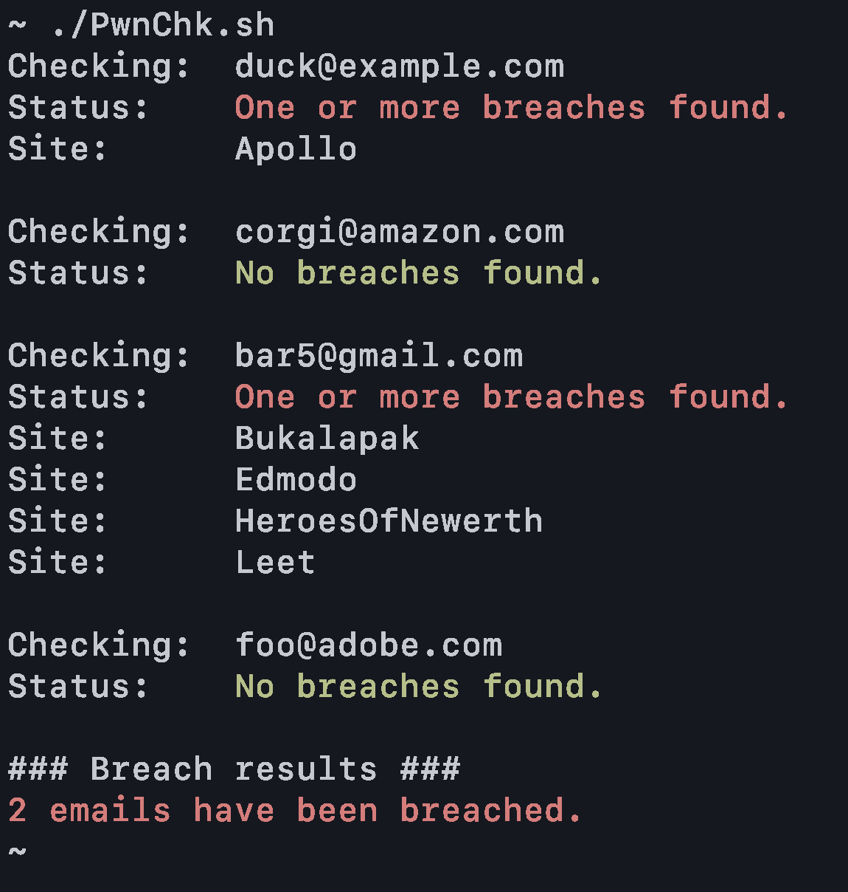

# PwnChk
### Burner email data breach status checker.

PwnChk checks the status of multiple burner emails to see if they have been breached. 
This is especially useful for those with numerous burner emails. 
Instead of checking the breach status of 200 different burner emails one at a time,
this script can accept a CSV file of burner emails and check the breach status
of each email using the Have I Been Pwned (HIBP) API.

API key:  https://haveibeenpwned.com/API/Key  
API docs: https://haveibeenpwned.com/API/v3
